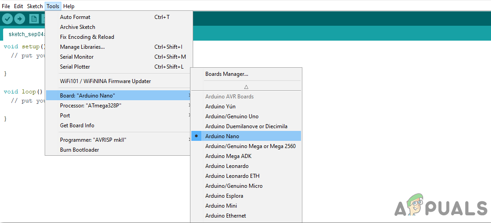
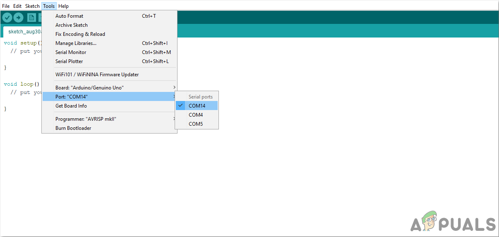
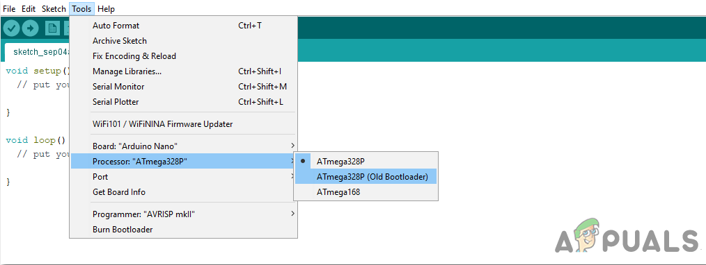
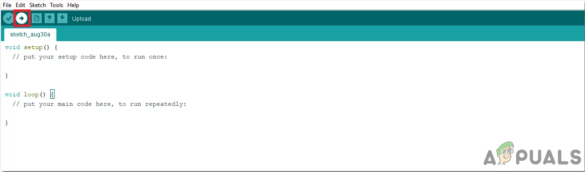

# Arduino下载使用指南

### 下载

Arduino IDE下载：https://www.arduino.cc/en/Main/Software，   根据自己系统类型选择版本，并选择合适的安装路径即可。

### 烧录程序

用Arduino IDE向Arduino Nano板烧录程序，用USB连接Nano板与电脑USB接口

1. 点击工具菜单，从下拉菜单中将板设置为Arduino Nano

   

2. 在同一工具菜单中，将端口设置为端口号
3. 在同一工具菜单中，将处理器设置为ATmega328P(旧引导加载程序)。
4. 上传程序

### 其他

关于Arduino IDE的其他功能可以参考

https://blog.csdn.net/as480133937/article/details/105331315

